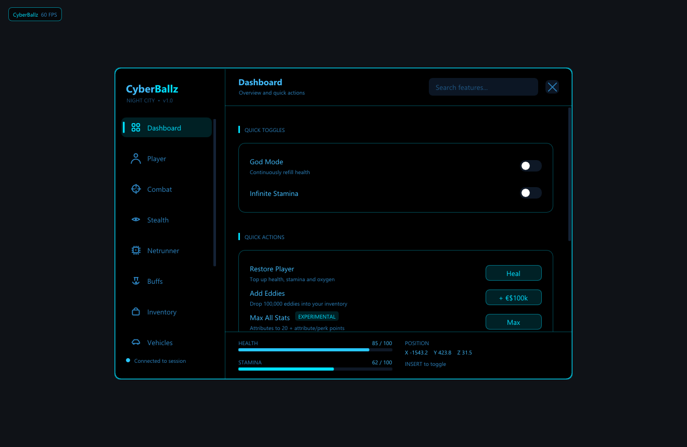
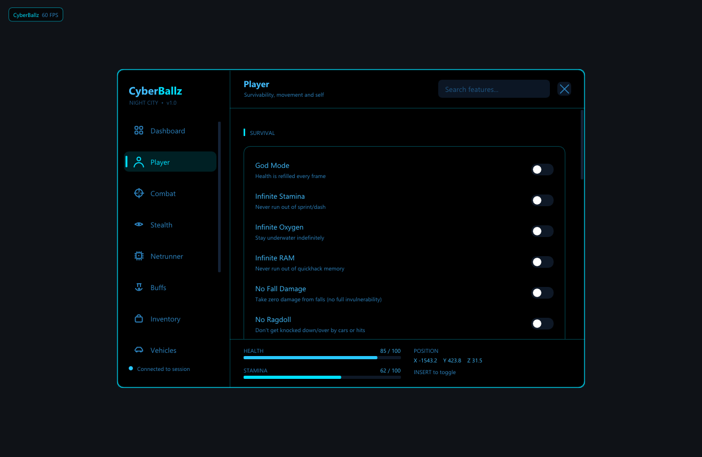
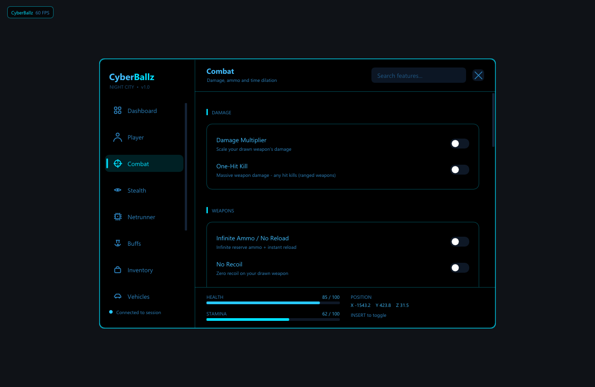
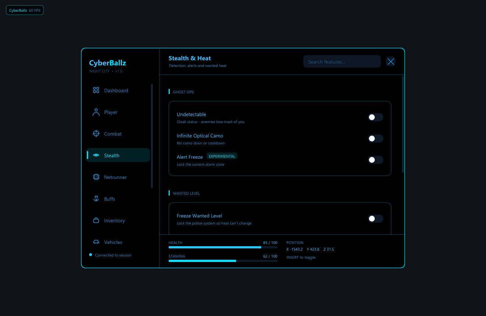
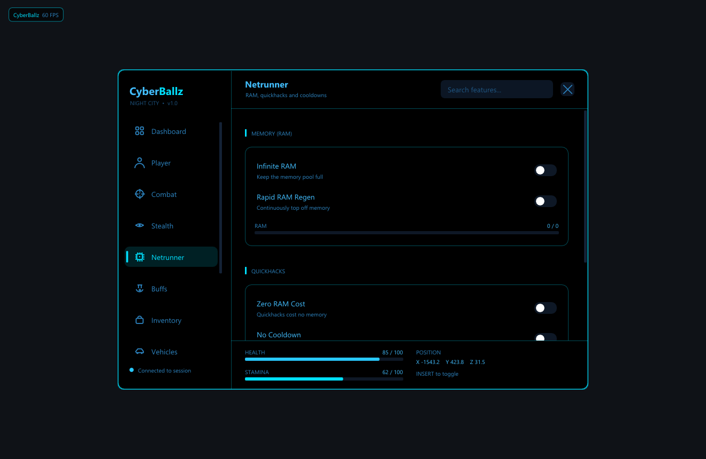
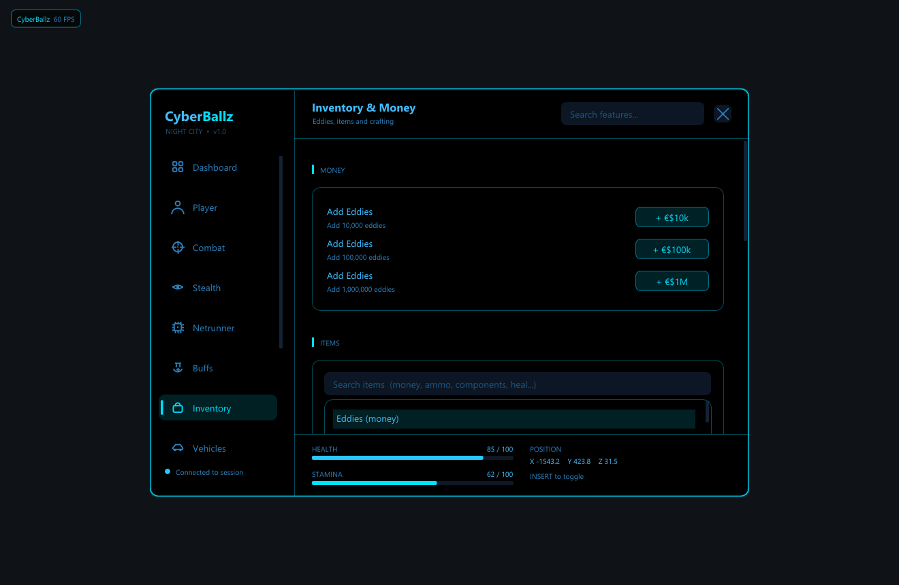
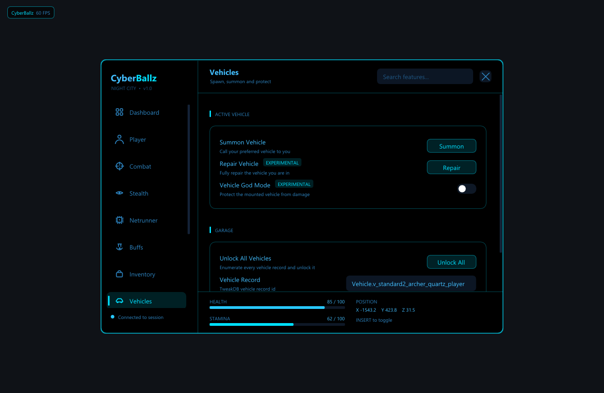
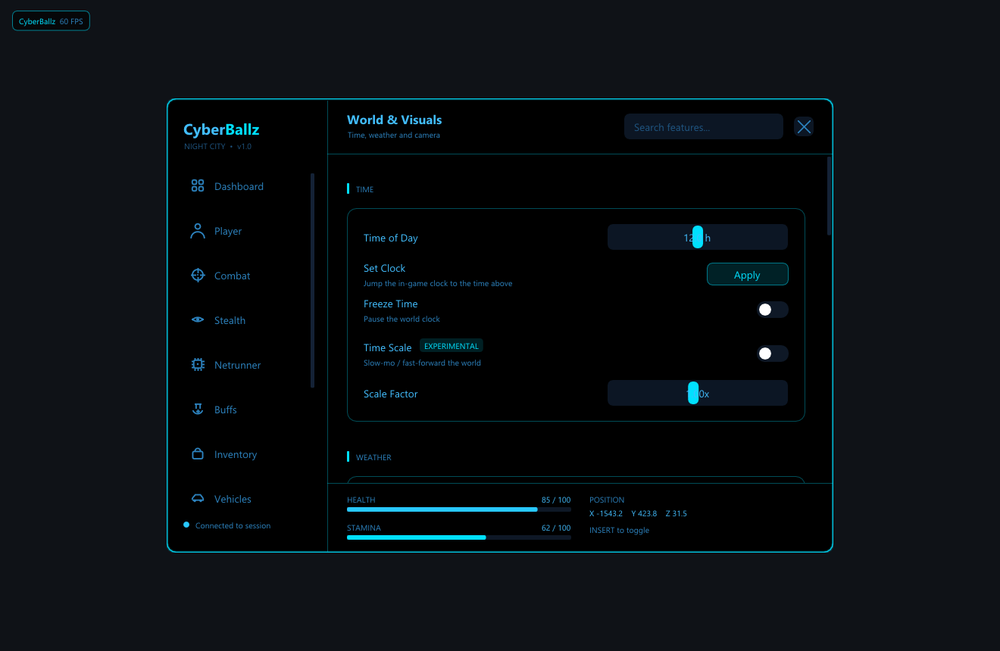
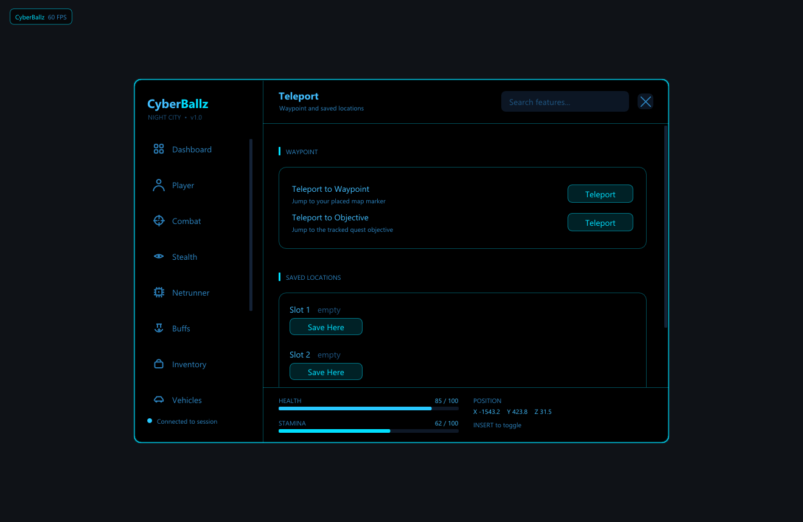
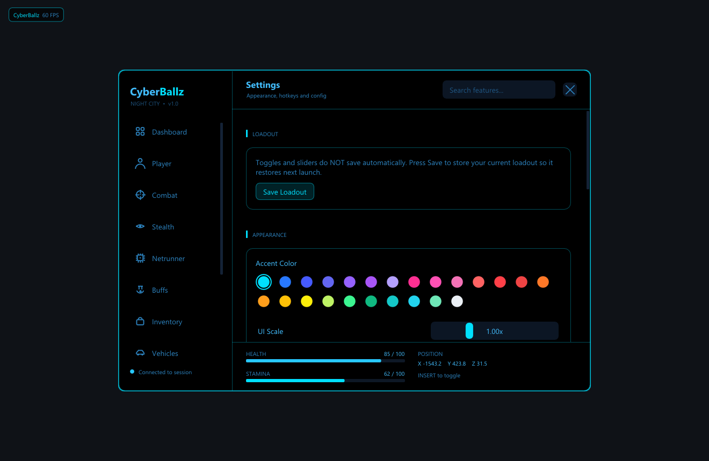

# CyberBallz

A single-player mod menu for **Cyberpunk 2077**. Native RED4ext + Codeware
plugin, DirectX 12 overlay, every toggle driven from the game thread so
nothing fights the engine.

Press **Insert** in a loaded save to open the menu.

---

## Install

1. Download the latest **`CyberBallz-Installer.exe`** from this repo (or the
   Releases page).
2. Run it. It auto-detects Steam, GOG, and Epic installs of Cyberpunk 2077,
   and pulls down RED4ext for you if it isn't already there.
3. Launch the game, load a save, press **Insert**.

You'll need [Codeware](https://github.com/psiberx/cp2077-codeware/releases)
for the NPC/vehicle spawner and a few of the camera/world features. The
installer will warn you if it's missing but the rest of the menu still works
without it.

To uninstall, run the installer again with the `--uninstall` switch, or just
delete `red4ext/plugins/CyberBallz/` from your game folder.

---

## What's in the menu

### Player
Survivability, movement, no-clip, infinite stamina/oxygen/RAM, jump tuning.

### Combat
Damage multipliers, infinite ammo, rapid fire, no recoil, time dilation, one
shot kill.

### Stealth & Heat
Undetectable, never-alert NPCs, hold wanted level at a chosen stage (or pin
it at 0 to never get a star), force-clear the police.

### Netrunner
Free quickhacks, instant upload, no RAM cost, scan-through-walls, breach
shortcuts.

### Inventory & Money
Add money in bulk, repair gear, instant crafting, weight off. Item browser
for spawning weapons, mods, consumables, cyberware.

### Vehicles
Spawn any vehicle in the game, godmode the current one, no-collision
driving, vehicle speed multiplier, instant despawn.

### World & Visuals
Override FOV, time of day, weather. Auto-skip cutscenes. Free camera.
Ragdoll nearby NPCs. Photo-mode anywhere.

### Teleport
Save/jump waypoints, teleport to objective, teleport to last vehicle, fast
travel any-time.

### Settings
Hotkey rebinding, accent color, UI scale, watermark + FPS toggle, theme
loader.

---

## Saving your setup

The Profiles tab saves the full toggle/value state as a named loadout you
can swap between. Personas (one-shot presets like *Stealth Ghost*, *Combat
God*, *City Tourist*) are built in. Files live under
`%LOCALAPPDATA%\CyberBallz\profiles\` so they're easy to back up or share.

---

## Requirements

| | |
|---|---|
| Game | Cyberpunk 2077 **2.3.1** |
| Loader | [RED4ext](https://github.com/WopsS/RED4ext) (installer fetches it for you) |
| Optional | [Codeware](https://github.com/psiberx/cp2077-codeware) 1.20.3+ (spawner, some world features) |
| OS | Windows 10 / 11, x64 |

Single-player only. Do not use online or with multiplayer mods.

---

## Troubleshooting

- **Menu doesn't open.** Make sure RED4ext loaded - check
  `red4ext/logs/CyberBallz.log` for `install check`. If it's empty, RED4ext
  isn't picking up the plugin.
- **A binding shows MISS.** Open the in-menu *Dashboard*, hit **Run
  self-check**, then look at `%LOCALAPPDATA%\CyberBallz\selfcheck_*.md`.
  That report tells you which game class wasn't found on your build.
- **Game crashed.** The per-feature crash guard contains faults to the
  group that misbehaved, so the rest of the menu keeps running. The crash
  is logged with the feature id in `CyberBallz.log`.

---

## License

The full text is in [LICENSE](LICENSE). The short version:

**This project's license is based on MIT, but with one important change:
redistribution is not allowed.** Specifically:

- You **can** use CyberBallz for your own single-player Cyberpunk 2077
  saves, modify the source for your own use, copy it between your own PCs,
  and read the code to learn from it.
- You **cannot** republish, redistribute, mirror, or upload CyberBallz
  (modified or not, source or binary) to any other site, mod hub, or
  third party.
- You **cannot** sell, rent, sublicense, or bundle CyberBallz with any
  other product, paid or free.

If you want to share it with someone, link them to this repo - don't host
a copy yourself.
